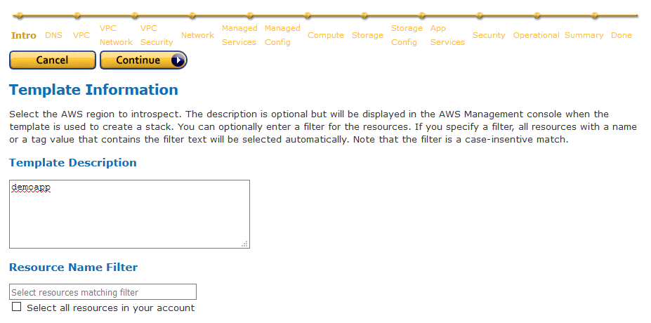
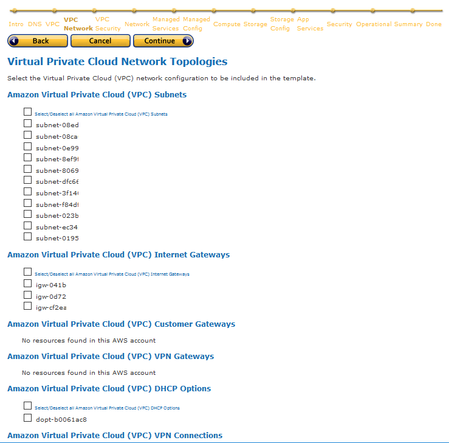
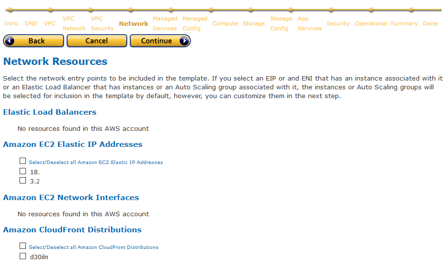
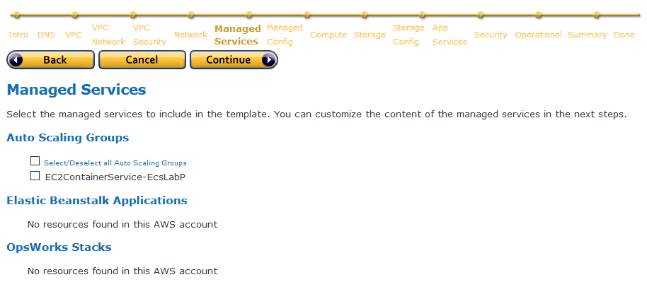
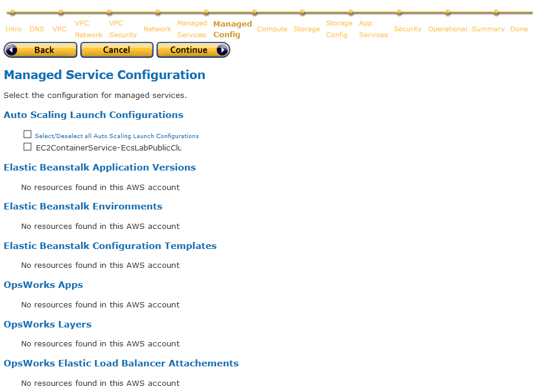
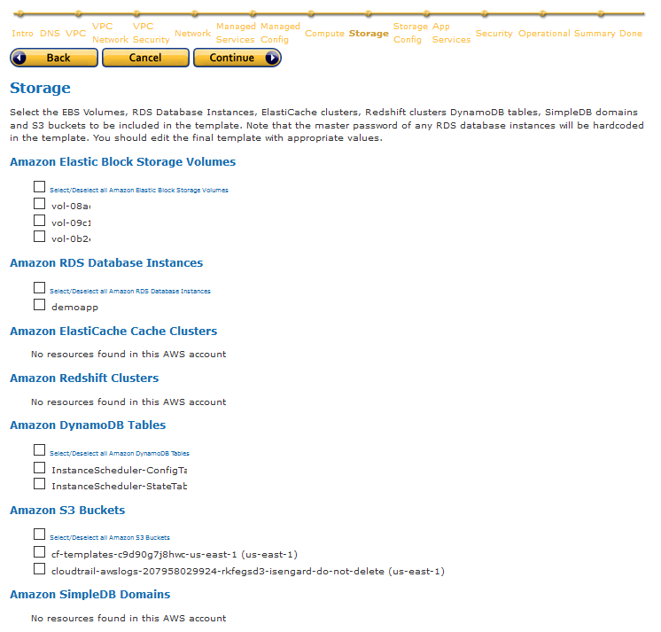

# poc-cloudformer

POC of using Cloudformer to duplicate an AWS environment

## Context

A workload is already running in a region, say us-east-1 (N. Virginia), consisting of core AWS services including VPC, EC2, RDS, Lambda, and ECS/ECR. The workload was not deployed using any configuration management tools, however, we would like to duplicate it to other region, say us-west-1 (N. California).

## Use Case

Cloudformer is a template creation tool that creates Cloudformation template from existing AWS resources in your account.

Cloudformer will be used to create an initial template of the origin region (us-east-1).

The template will then be adjusted to be able to work in destination region (us-west-1).

Cloudformer does not support creating templates of Lambda and ECS/ECR. It also does not support NAT gateway. For these unsupported resources, the template will need to be updated manually.

The resulting template is then deployed to create new stack in the destination region.

## Getting Started with Cloudformer

Follow the instruction in this page:

https://docs.aws.amazon.com/AWSCloudFormation/latest/UserGuide/cfn-using-cloudformer.html

Once the Cloudformer stack is deployed, access the user interface via web browser at the Cloudformer's instance public IP or DNS.

Follow the Cloudformer template creation wizard to generate your template. Choose the region you wish to capture, and choose all the resources you wish to be templatized. At the end of the steps, Cloudformer will save the generated template in an S3 bucket of your choice.

### Provide Template Name

### Choose DNS resources

### Choose Which VPCs to be Included

### Choose VPC Network Topology Resources

### Choose VPC Security Resources

### Choose VPC Network Resources

### Choose Managed Services Resources

### Choose Managed Config

### Choose Compute Resources

### Choose Storage Resources

### Choose Storage Config

### Choose Application Services

### Choose Security Resources

### Choose Operational Resources

### Review the selected resources

### Save the template and Download It

Download the resulting template to your computer for adjustments.

## Template Adjustments

The resulting template from Cloudformer can be used to launch a new stack. However, as it is, there is likely some adjustments that you need to make.

### Adjustment 1: Rename Resources in the Template

A human-friendly resource names will improve template readability and makes maintenance easier.

As an example, using your favorite tool, run a diff between `01-cloudformer-initial.template.json` and `02-cloudformer-rename.template.json`.

### Adjustment 2: Change Availability Zones and Merge/Split Resources

The destination region AZs will be different than original region AZs. You should change the AZs in the template to fit the destination region. Or even better, use Cloudformation Mappings to make the template more universal.

If the destination region has less Availability Zones compared to the AZs being used in the origin region, you would have to consider merging resources into the same AZs. For instance, if I use `us-east-1a`, `us-east-1b`, and `us-east-1c` AZs in `us-east-1` region, while in `us-west-1` region there is only 2 AZs, I would probably consider merging `us-east-1b` and `us-east-1c` resources into `us-west-1b`.

Run a diff between `02-cloudformer-rename.template.json` and `03-cloudformer-changeregion.template.json`.

### Adjustment 3: Add Missing Resources

For Elastic IP, you have to create new ones in the destination region as EIPs cannot be ported between regions.

Cloudformer does not support NAT Gateways. You should add these manually.

Run a diff between `03-cloudformer-changeregion.template.json` and `04-cloudformer-missingresources.template.json`.

### Adjustment 4: Region-level Resources

Region-level resources such as AMI, KeyPair, and Elastic IP will not be usable in the destination region.

For AMIs, if you use your own AMIs, you have to copy the image to the destination region. If you use Marketplace AMI or AWS-maintained AMI, you just have to find the corresponding AMI ID in the destination region.

For Keypairs, you have to create new ones in the destination region as there is no way to copy Keypairs out of a region. You can create Keypair of the same name to avoid having to adjust the template.

Run a diff between `04-cloudformer-missingresources.template.json` and `05-cloudformer-images.template.json`.

### Further Considerations

Following best practices of writing Cloudformation template, you should consider at least the following:

* Add Parameters to enable stacks to be customized at launch time.
* Add Mappings to allow the template to be customized to the specific environment.
* Replace static values with "`Ref`" and "`Fn::GetAtt`" functions to flow property data between resources where the value of one property is dependent on the value of a property from a different resource.
* Remove any static IP addresses, availability zones and other environmental properties to create more generalized configurations.
* Use CloudFormation metadata and on-host helper scripts to deploy files, packages and run commands on your Amazon EC2 instances.
* Customize any RDS Database, ElastiCache cluster or Redshift cluster passwords.
* Customize or add more stack outputs to list important information needed by the stack user.

