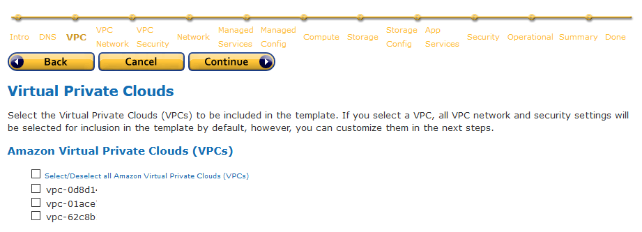
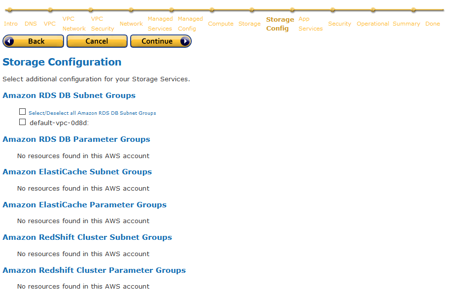
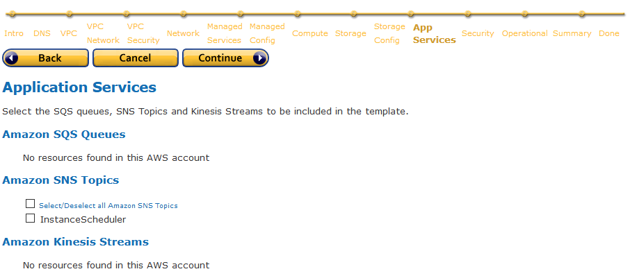
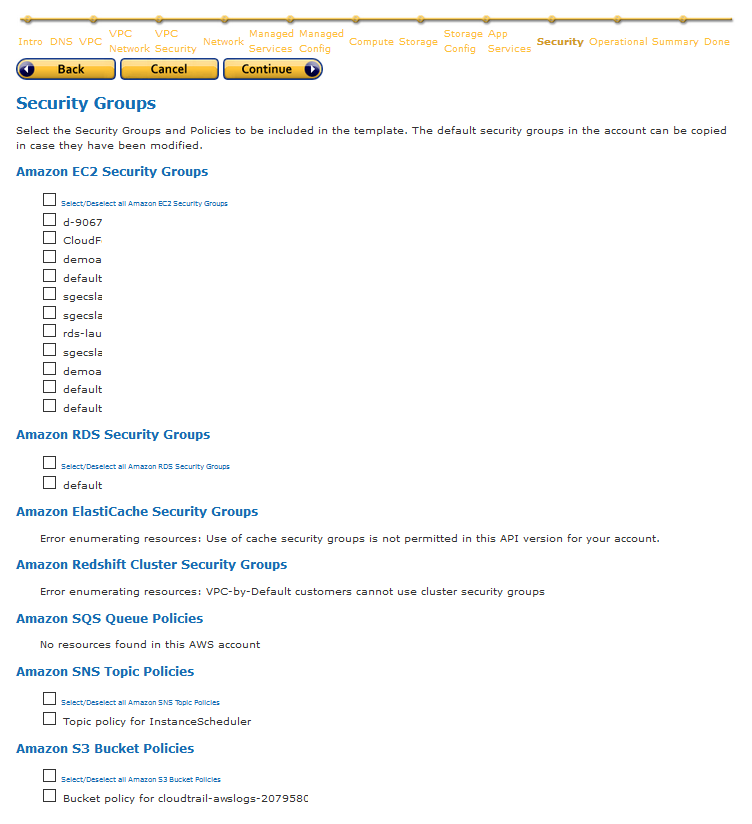
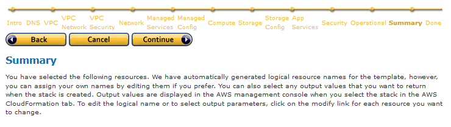
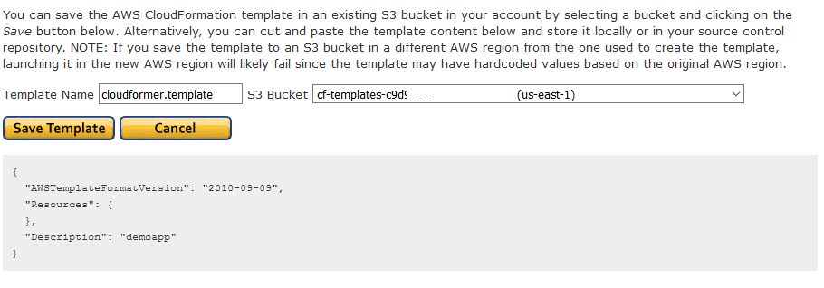

# poc-cloudformer

POC of using Cloudformer to duplicate an AWS environment

## Context

A workload is already running in a region, say us-east-1 (N. Virginia), consisting of core AWS services including VPC, EC2, RDS, Lambda, and ECS/ECR. The workload was not deployed using any configuration management tools, however, we would like to duplicate it to other region, say us-west-1 (N. California).

## Use Case

Cloudformer is a template creation tool that creates Cloudformation template from existing AWS resources in your account.

Cloudformer will be used to create an initial template of the origin region (us-east-1).

The template will then be adjusted to be able to work in destination region (us-west-1).

Cloudformer does not support creating templates of Lambda and ECS/ECR. It also does not support NAT gateway. For these unsupported resources, the template will need to be updated manually.

The resulting template is then deployed to create new stack in the destination region.

## Getting Started with Cloudformer

Follow the instruction in this page:

https://docs.aws.amazon.com/AWSCloudFormation/latest/UserGuide/cfn-using-cloudformer.html

Once the Cloudformer stack is deployed, access the user interface via web browser at the Cloudformer's instance public IP or DNS.

Follow the Cloudformer template creation wizard to generate your template. Choose the region you wish to capture, and choose all the resources you wish to be templatized. At the end of the steps, Cloudformer will save the generated template in an S3 bucket of your choice.

Download the resulting template.

## Template Adjustments

In my case 